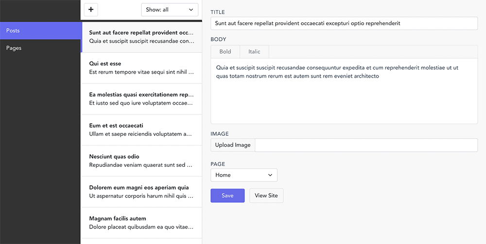

# Vue Headless CMS

Headless CMS that runs off (and saves to) a single JSON file. Written in Vue 3, bundling through Vite

## Demo

<https://vue-headless-cms.vercel.app/>

## Features

-   headless: can be used with your preferred front-end (Vue, React, Svelte, vanilla js, Nodejs, PHP, Static Site Generator)
-   quick-access through mail-like interface
-   saves to a single JSON file
-   easily configure collections and fields
-   categories and filtering
-   rich text editor
-   image upload and resize

## Preview

## Documentation

For documentation on how to create new content types, configuring site-wide settings and integrating with your own front- and backend, check the [documentation wiki](https://github.com/dashpilot/vue-headless-cms/wiki)

## Press the :star: button

Don't forget to press the :star: button to let me know I should continue improving this project.
